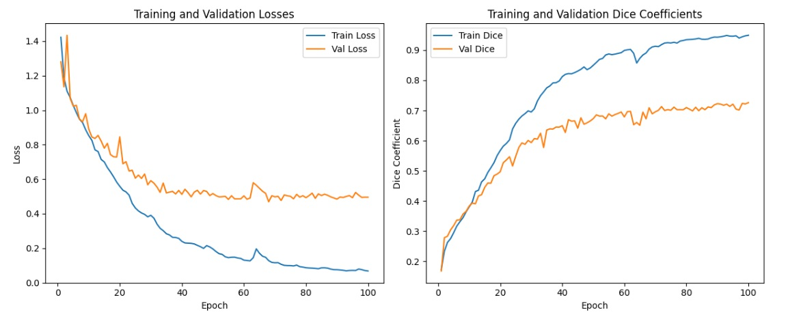

# Breast Cancer Image Segmentation with U-Net using PyTorch

## Overview

This project implements a U-Net model for breast cancer image segmentation using the PyTorch deep learning framework. The U-Net architecture is a popular choice for image segmentation tasks, showing success in medical image analysis, including breast cancer segmentation.

## Table of Contents

- [Overview](#overview)
- [Getting Started](#getting-started)
- [Installation](#installation)
- [Usage](#usage)
- [Dataset](#dataset)
- [Model Architecture](#model-architecture)
- [Results](#results)
- [Contributing](#contributing)

## Getting Started

### Installation

1. Clone the repository:

    ```bash
    git clone https://github.com/parsakhavarinejad/Breast_cancer_image_segmentation.git
    cd Breast_cancer_image_segmentation
    ```

2. Install the required dependencies:

    ```bash
    pip install -r requirements.txt
    ```

### Usage

- To train the U-Net model and visualize images with masks, run:

    ```bash
    python main.py
    ```

## Dataset

The dataset is available on Kaggle:
[https://www.kaggle.com/datasets/aryashah2k/breast-ultrasound-images-dataset/](https://www.kaggle.com/datasets/aryashah2k/breast-ultrasound-images-dataset/)

The Breast Ultrasound Dataset, collected in 2018 from 600 female patients aged 25 to 75, consists of 780 ultrasound images in PNG format, each with an average size of 500x500 pixels. Enriched with ground truth images, it categorizes cases into normal, benign, and malignant, making it a valuable resource for machine learning models in breast cancer detection, classification, and segmentation. This well-annotated dataset contributes significantly to advancing research in medical imaging applications.

If you want to try the project, download the dataset and place it inside the `data` folder.


## Model Architecture

The U-Net model is well-suited for medical image segmentation. For more details on the U-Net architecture, refer to the image below:


## Results

After training, view some results, including images and loss plots:

- Example results: 

- Loss plots: 


## Contributing

Feel free to contribute to the project.

